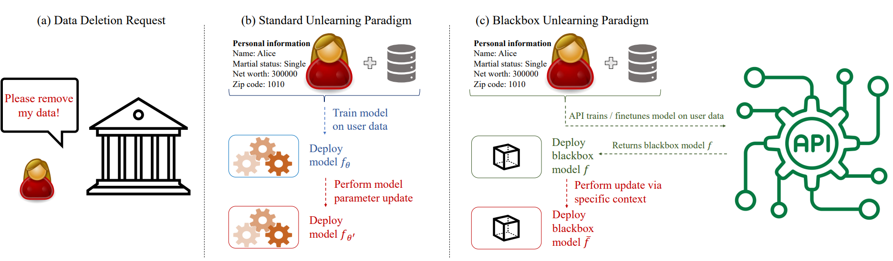
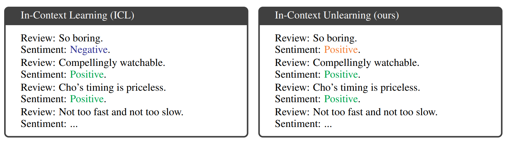

# In-Context Unlearning

Although unlearning is particularly relevant for LLMs in light of the copyright issues they raise, achieving precise unlearning is computationally infeasible for very large models. To this end, recent work has proposed several algorithms which approximate the removal of training data without retraining the model. These algorithms crucially rely on access to the model parameters in order to update them, an assumption that may not hold in practice due to computational constraints or when the LLM is accessed via API. In this work, we propose a new class of unlearning methods for LLMs we call ''In-Context Unlearning'', providing inputs in context and without having to update model parameters. To unlearn a particular training instance, we provide the instance alongside a flipped label and additional correctly labeled instances which are prepended as inputs to the LLM at inference time. Our experimental results demonstrate that these contexts effectively remove specific information from the training set while maintaining performance levels that are competitive with (or in some cases exceed) state-of-the-art unlearning methods that require access to the LLM parameters.



### ArXiv Preprint
For a more detailed introduction to aspects presented here please have a look at our paper available on arXiv:

>["In-Context Unlearning: Language Models as Few Shot Unlearners"](https://arxiv.org/abs/2310.07579); Martin Pawelczyk, Seth Neel* and Himabindu Lakkaraju*;
arXiv preprint: arXiv:2310.07579;  2023.

### Method Overview

The main goal of our framework is to eliminate the need to re-finetune the model from scratch or to update the parameters of the model when unlearning a specific training data point. 
Therefore, at inference time, we construct a specific context that ideally lets the language model classify text as if it had never seen the specific data point during training before.
To this end, our framework leverages incorrectly and correctly labeled examples to construct the following prompt which is provided as input to the LLM at inference time.
More specifically, we suggest the following 3 step prompt construction approach which we term ICUL:

1. **Step**: **Flip label on forget point.** Given a deletion request, we flip the label on the corresponding training point whose influence should be removed from the model resulting in the template: $[\text{Forget Input}]_0$ $[\text{Flipped Label}]_0$.

2. **Step**: **Add $s$ correctly labeled training points.**
Next, excluding the forget point, we randomly sample $s$ labeled example pairs which we add to the template of step 1, resulting in the updated template: $[\text{Forget Input}]_0$ $[\text{Flipped Label}]_0$ \n  $[\text{Input 1}]_1$ $[\text{Label 1}]_1$ \n $\cdots$ $[\text{Input s}]_s$ $[\text{Label s}]_s$.

3. **Step**: **Prediction.** Finally, we add the query input to the template resulting in the final prompt $[\text{Forget Input}]_0$ $[\text{Flipped Label}]_0$ \n  $[\text{Input 1}]_1$ $[\text{Label 1}]_1$ \n $\cdots$ $[\text{Input s}]_s$ $[\text{Label s}]_s$  $[\text{Query Input}]$  and let the model predict the next token using temperature $t=0$.




### Getting started

**1. Create conda environment and install requirements**

```
conda create -n unlearn_eval python=3.10 
conda activate unlearn_eval
# Install the correct torch version depending on CUDA version from https://pytorch.org/
pip install -r requirements.txt
```

To replicate the results, we first need to finetune the models, then run the evaluation script and finally analyze the results.
You need to take the following steps in that order.

**2. Run models**

For example, to train the models on the SST-2 dataset using the 1.1B Bloom model do the following:
```
sbatch run_sbatchs_ubs1/1b1/run_sst2_ubs1_bloom1b1.sbatch
```

**3. Run evaluations & save results**

For example, the snippet below runs the evaluation for the random ICUL setup shown in Figure 4 of the main paper. 
```
--array=0-9 eval_sbatches_ubs1/1b1/ablations/eval_sst2_n_ctxt2_ablation-exchange_bloom1b1.sh
```
When you want to run the evaluation using gradient ascent (GA) as an unlearning method, make sure to to set ``"unlearning_methods": ["ga"]`` in the config file: ``config_eval_rep.json``. For example, after you have modified ``config_eval_rep.json``, run:
```
--array=0-9 eval_sbatches_ubs1/1b1/GA/eval_sst2_n_ctxt2_vary_bloom1b1.sh
```

**4. Analyze results using notebooks**
- ``analyze_info_in_unlearned_model.ipynb``: Conducts unlearning efficacy analysis from section 5.2 in the paper.
- ``analyze_kmodels_performance.ipynb``: Computes accuracy for different data subsets from Section 5.3 in the paper.
- ``analyze_ablation.ipynb``: Conducts sensitivity analysis from section 5.4 in the paper.


### Credits
```
@article{pawelczyk2023context,
  title={In-Context Unlearning: Language Models as Few Shot Unlearners},
  author={Pawelczyk, Martin and Neel, Seth and Lakkaraju, Himabindu},
  journal={arXiv:2310.07579},
  year={2023}
}
```
